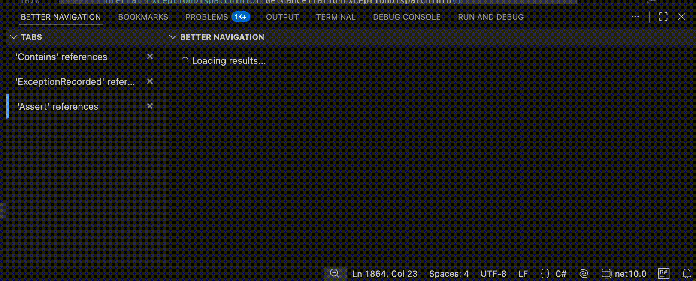
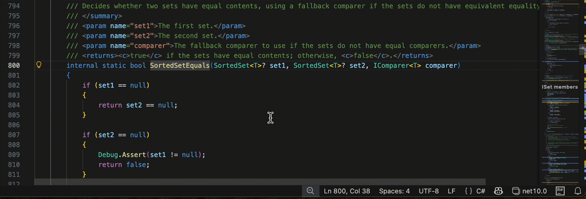
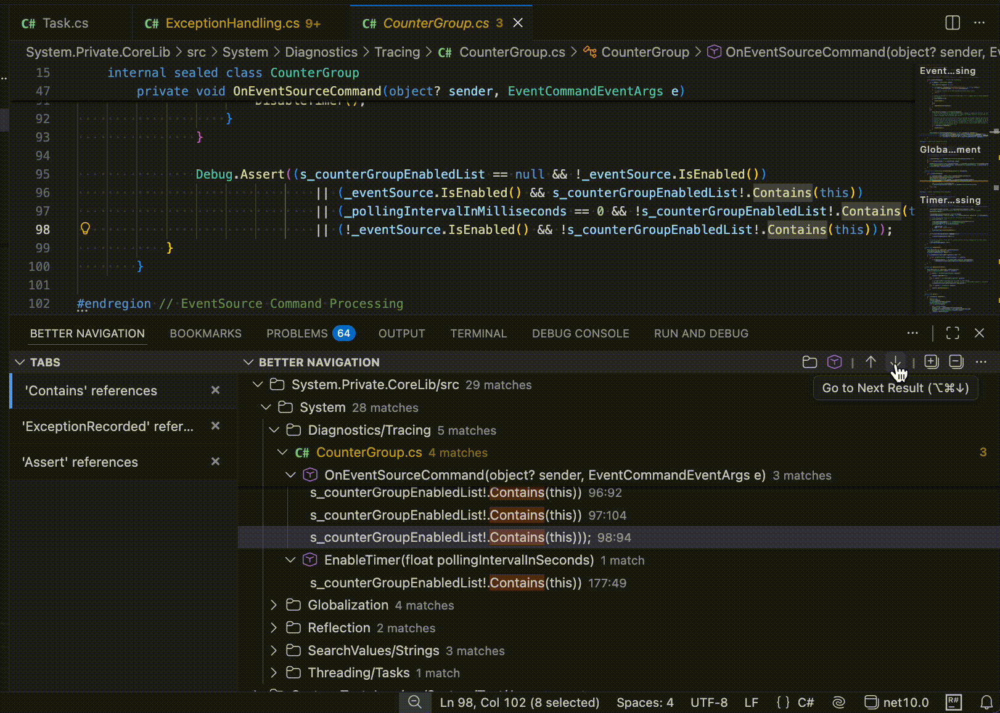

# Better Navigation

Enhanced **Find References** (and **Find Implementations**) for VS Code: smarter grouping, multi-tab results, and faster navigation — while still using **native VS Code controls** for great performance.

> **Status:** Early release

## Features

### Multi-tab Find References

Run multiple reference searches and keep them available **at the same time**:

- Switch between previous searches instantly
- Keep old results visible while a new search is still running
- Native VS Code results UI means it stays fast and familiar  
  (including built-in behavior like **F3** navigation and sticky lines)

---

### Smart grouping (directory + symbol)

Make large result sets readable:

- **Group by directory** to match project structure
- **Group by file symbol** (class, method, property, etc.)

---

### Direct navigation when the result is single

When a search resolves to **exactly one result**, Better Navigation can take you there immediately.

- No extra clicks
- Works great for “jump to definition-like” reference queries
- Configurable timeout: control how long to wait before deciding it’s a single result

---

### Navigate next/previous across global results

Move through results without refocusing the results tree:

- Jump to **Next result**
- Jump to **Previous result**
- Works across the current search tab’s entire result set

---

### Extremely configurable

Almost every behavior is configurable, including:

- Which **member types** are used for smart grouping
- Direct navigation behavior and timeout
- Tab display style
- (…and more)

---

## Getting started

- Open the editor and place the caret on a symbol.
- Press `Shift+F12` or run the `better-navigation.findReferences` command manually.
- Enjoy the Better Navigation experience.

## TODO:

#### Main features:
- [x] Tabs and multisearch
- [x] Auto-expand first result in tree view
- [x] Preserve expanded state and selected element after rebuilding the tree and switching between results
- [x] Display proper loading states
- [x] Add an optional grouping by the directory
- [x] Add an optional grouping by the member
- [ ] Commands and keybindings:
    - [x] Run search with default shortcuts
    - [x] Navigate between results
    - [ ] Switch between result tabs
- [x] Add an ability to navigate to a single result directly
    - [x] Add status bar item 'waiting for sync navigation...'
    - [x] ~~Ignore the item under caret? (TS support always return the symbol itself + usages. Especially bad if no real usages)~~ Would be too inconsistent. "No other results found" is good enough for now

#### Features:
- [x] Implement references search
- [x] Implement base inheritors search
- [ ] Implement incoming calls (?)
- [ ] Implement type hierarchy (?)
- [ ] Add an option to show a quickpick instead of a result tree (with an option to switch to the tree view). But probably will have a performance hit: we would need to open all documents non-lazily
- [ ] Add an alternative "tabs" view: show a quick pick when needed

#### Improvements:
- [ ] Add reuse of search tabs:
    - [ ] Overwrite last item if it was not used (no clicks, no navigation, or "no results")
    - [ ] Go back to the existing result if search is on the same location and no changes happened? (But what if LSP server's state has changed... Refresh button?)
- [ ] Grouping by member looks strange when we are searching 'implementations': member is in fact the result (but what if it's a method parameter that looks extremely alike? Lsp will not help here)
- [ ] Add an optional grouping by write\read usages (custom API required)
- [ ] Cancel search if tab is closed before it finishes
- [x] ~~Add an ability to type in results to filter them~~ - F3!!!
- [x] Add counter "N result(s)" to each item in a tree
- [x] Use better icons to display the grouping state
- [x] Can't switch tab when long "loading results" is in progress
- [ ] `'get' usages` when searching for property usages 🗿. Only custom API could help?
- [x] View is not hidden after "Restart extensions"
- [ ] Check, can we relax the vscode version requirement